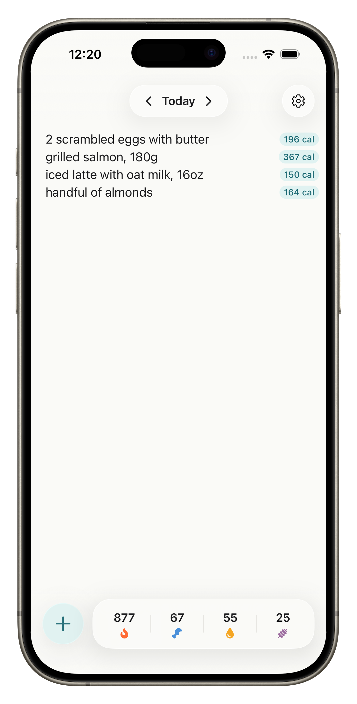
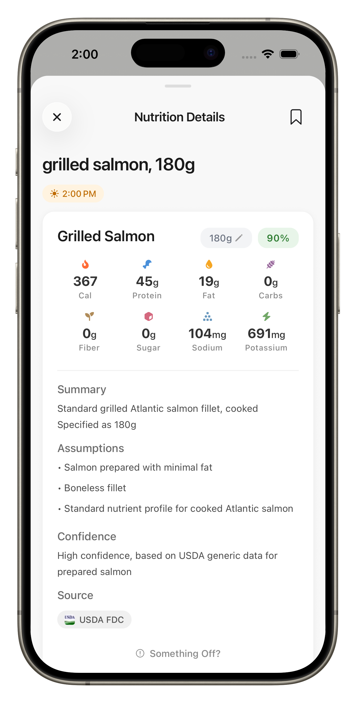
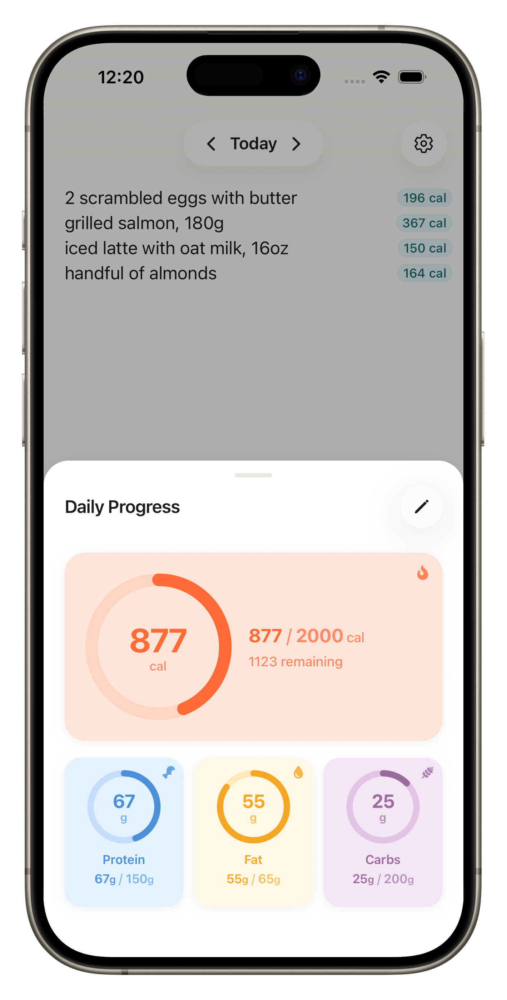
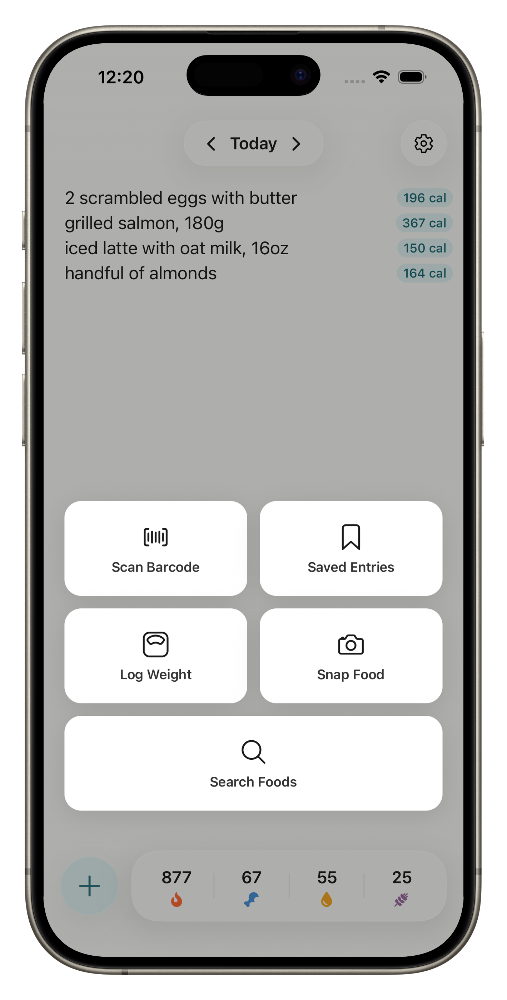

<h1 align="center">NoteCal</h1>

A nutrition tracker that feels like a notes app. 
Type a line of food. Get the calories, macros, and progress toward your goal.

<a href="https://notecal.app">notecal.app</a>

  
  
  
  

## The idea

Most calorie apps make you search a database, pick a serving size, and tap through forms. NoteCal lets you write `2 eggs` or `oats, 50g` and figures the rest out — portion, brand, prep — using AI grounded in real nutrition data. Every estimate shows its reasoning so you can sanity-check it.

## Features

- AI nutrition lookup with confidence scores and source citations
- Daily calorie + macro targets from a quick goals wizard (Mifflin–St Jeor)
- Weight log with photos and trend charts
- Saved meals for instant reuse, no lookup needed
- Fully offline-capable; entries resolve when you reconnect
- Optional Google / Apple sign-in for cross-device sync
